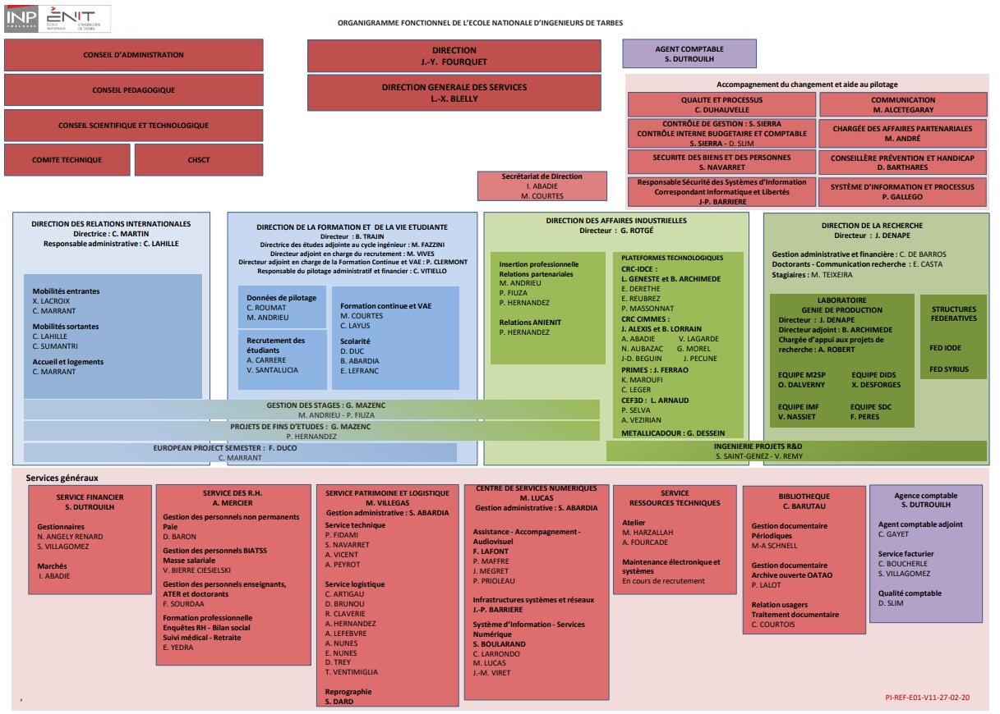

# Présentation de l'ENIT
L’ENIT est une école d’ingénieurs publique généraliste de haut niveau, dont le diplôme est habilité par la CTI (Commission des Titres d’Ingénieur). Elle est tournée vers l’international et dotée d’une recherche innovante, elle forme des ingénieurs généralistes en génie mécanique et génie industriel.

## L'ENIT en quelques chiffres  
- Plus de 55 ans d'existence (création en 1963)
- Un réseau de 7000 ingénieurs
- 1200 étudiants inscrits
- 200 à 250 nouveaux diplômés par an
- 600 stages par an en entreprise
- 160 enseignants
- + de 3000 entreprises partenaires
- Un laboratoire de recherche de plus de 130 personnes
- 95% des diplômés trouvent un emploi en moins de 6 mois
- Des partenariats avec 161 universités dans 37 pays
- Membre du Centre Universitaire Tarbes Pyrénées (CUTP)
- Rattachée depuis 2002 à Toulouse INP (Institut National Polytechnique)  

Suivez-nous sur les réseaux sociaux !

# Les Directions
Voici les principales directions ou services avec lesquels vous serez en contact :

#### DIRECTION DE L'ECOLE
Sa mission est de piloter et de définir la stratégie de l’école. Vous serez amené à rencontrer le directeur concernant : des projets, des événements, des autorisations de soirée étudiante, etc…. Elle organise les élections des représentants des élèves ingénieurs aux conseils d’administration, pédagogique, scientifique et technologique, etc.

#### DIRECTION DE LA FORMATION ET DE LA VIE ETUDIANTE
Elle a pour mission le pilotage de la formation et de la vie étudiante, mais aussi l’organisation de la pédagogie.  

Le service Scolarité répondra à toutes les questions concernant : l’inscription et le suivi administratif des élèves, la délivrance du diplôme, les demandes d’absence, les besoins d’aménagement de la scolarité, etc.  

Le service Admissions aura besoin de vous pour participer à des actions de promotion de l’école : interventions devant des classes de lycéens, forums, salons étudiants. Ces actions permettent d’acquérir des points Valorisation Des Projets Étudiants (VPE).  

Le service Formation Continue vous orientera pour effectuer la dernière année en contrat de professionnalisation. Il s’occupe également des VAE (Valorisation des Acquis de l’Expérience) et de la formation continue.

#### DIRECTION DE LA RECHERCHE
Sa mission est d'orienter la politique de recherche et de valorisation. Elle coordonne les activités du Laboratoire Génie de Production (LGP) et des plateformes technologiques, participe au pilotage des Centres de Ressources et de Compétences (CRC), et a également pour mission de développer les partenariats académiques et industriels. Le LGP vous accueille en stage au sein du laboratoire (S3, S6, PFE, Master Recherche).

#### DIRECTION DES AFFAIRES INDUSTRIELLES
Elle a pour mission la gestion des partenariats avec les entreprises dans les domaines de l’insertion professionnelle, du transfert de technologie, et de la recherche. Pour la partie insertion professionnelle qui vous concerne au 1er chef, elle assure la gestion des stages et des PFE, l’accompagnement vers l’emploi, et organise des évènements en partenariat avec le milieu socio-professionnel (forum des entreprises, job dating, etc…).

#### DIRECTION DES RELATIONS INTERNATIONALES
Une des missions consiste à accueillir et informer les étudiants qui ont un projet de séjour à l’étranger. Elle vous informera également des dispositifs d’accompagnement financier.

#### SERVICES GENERAUX
L’accueil se situe dans le bâtiment A, et est ouvert du lundi au vendredi de 7h30 à 12h30 et de 13h30 à 19h.  
Le Centre des Services Numériques répondra aux requêtes d’organisation des soutenances (VISIO), de carte étudiante, de problème de connexion LDAP, de configuration de matériel, etc.  
La Bibliothèque vous accueille dans le bâtiment E du lundi au jeudi de 8h30 à 19h et le vendredi de 8h30 à 18h pour emprunter des livres (technique ou divertissement), ou du matériel (kit tableau, zapette, casque audio, jeux, etc.). Il est également possible de venir pour travailler sur les postes informatiques mis à disposition, mais aussi venir se connecter au réseau Wifi avec votre propre matériel. La bibliothèque dispose aussi d’un coin repos pour se détendre.

### Organigramme

		
## Le campus tarbais en quelques chiffres
- 97 formations post-Bac allant jusqu'au Doctorat
- 6000 étudiants
- 28 établissements

## 1.4. Accès

#### Plan d'accès
2 Entrées possibles Avenue d'Azereix : Place de l'Ingénieur ou par le pôle Universitaire.
- En voiture = 9 min du centre ville.
- A vélo : Situé à 2.3km de la place Verdun (centre-ville) = 13 min.
- A pied : Situé à 2.3km de la place Verdun (centre-ville) = 25 min.
- En avion : 
	- Aéroport de Tarbes-Lourdes-Pyrénées : situé à 8km du campus. Accès par taxi / location de voitures.
	- Aéroport de Pau-Pyrénées : situé à 45km du campus. Navettes routières pour Tarbes / liaison SNCF / location de voitures.
- En train : La gare se trouve à 3.4km = 10 min en voiture ou 35 min à pied. Il est aussi possible de prendre le bus depuis la gare (lignes 1, 2, 4, 5 et 14).
- Transports en commun : 
	- Réseau de transports de Tarbes [Alezan](https://www.alezan-bus.com). Accès au domaine universitaire via les lignes : 
	- Route de Bours vers zone Bastillac et échangeur Ouest / Arrêt ENIT
	- Centre Universitaire vers LP Sixte Vignon / Arrêt Centre Universitaire
	- Centre Universitaire via Laubadère / Arrêt Centre Universitaire
	- Réseau de transports [Hautes-Pyrénées Maligne](https://www.hautespyrenees.fr/transports-routes/transports/transports-scolaires-et-interurbains).

## Plan ENIT

…

			

