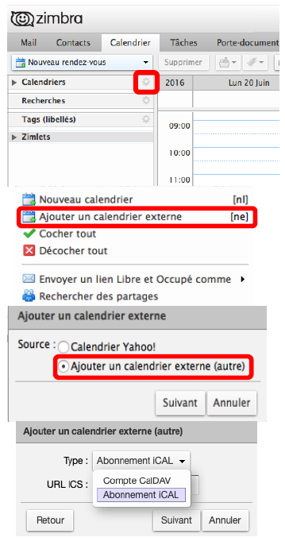
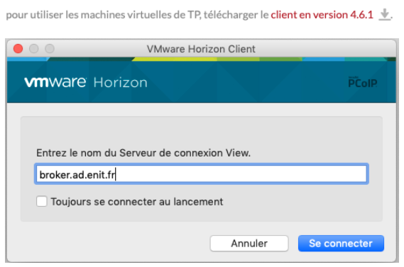

# Services numériques
L’ENIT propose divers services numériques, accessibles depuis le menu outils dans l’extranet (après vous être authentifié). L’authentification se fait par votre identifiant LDAP bâti de la manière suivante : initiale du prénom suivi du nom sur 8 caractères maximum. Cet identifiant est appelé pnom dans la suite du document. Cet identifiant et le mot de passe associé sont indiqués sur le certificat de scolarité remis lors de votre inscription.  

## Messagerie : Zimbra
Chaque membre de la communauté de l'ENIT (personnel ou étudiant) possède une boîte à lettres (adresse e-mail). Cette boîte à lettres est accessible à l'adresse mail.enit.fr, après identification (LDAP).  
L'ENIT communiquera avec vous uniquement sur cette adresse, il est donc primordial de consulter votre boîte à lettres régulièrement. Pour faciliter cette consultation, vous trouverez dans les paragraphes suivants des aides pour utiliser cette boîte à lettres dans vos appareils (téléphones et ordinateurs).

### Configurer Zimbra
Le compte mail principal associé à la boîte est de la forme : pnom@enit.fr, toutefois, afin de faciliter la communication, l'ENIT retient, pour chaque individu, une adresse au format : prenom.nom@enit.fr (sur le compte mail pnom). L'ENIT recommande l'utilisation de l'adresse prenom.nom@enit.fr dans les communications et les échanges.  
Pour que cette adresse soit votre adresse par défaut, merci de configurer votre boîte :
		- Dans l'interface web de votre compte mail (mailetu.enit.fr), aller dans Préférences  
		  
		- Dans Comptes, configurer les paramètres du compte principal de manière à ce que l'adresse prenom.nom@enit.fr soit utilisée par défaut.  
		  

### Configurer un logiciel de messagerie
#### Thunderbird
- Lancer le client de messagerie
- Menu Outils / Paramètres de comptes
- Cliquer sur "Gestion des comptes" / "ajouter un compte de messagerie"
- Compléter les informations :
  - Votre nom et prénom : Prénom Nom
  - Adresse électronique : prenom.nom@enit.fr
  - Mot de passe : le mot de passe du compte LDAP  
  
Cliquer sur continuer, le système recherche les informations vous concernant. Cela peut durer quelques secondes. Il vous propose des informations qui ressemblent à celles-ci.  
  
- Choisir IMAP
- Cliquer sur le bouton Configuration Manuelle et changer les informations :
  - Serveur entrant : mailetu.enit.fr, port 993
  - Serveur sortant : mail.enit.fr, port 465
  - Identifiant : pnom  

#### Mail dans IOS
- Ouvrir les réglages du téléphone
- Aller dans Mot de passe et comptes
- Choisir "Ajouter un compte"  
  
- Choisir "Ajouter un compte Mail"
- Remplir les informations demandées :
  - Nom : Prénom Nom
  - Adresse : prenom.nom@enit.fr
  - Mot de passe : le mot de passe du compte LDAP
  - Description : ENIT
- Compléter les informations du compte (réception et envoi) : 
  - Serveur : mailetu.enit.fr
  - Nom d'utilisateur : pnom
  - Mot de passe : mot de passe LDAP  
  

#### Mail dans MacOS
- Ouvrir préférences système
- Aller dans Comptes internet
- Choisir "Ajouter un compte  
  
- Choisir compte Mail  
  
- Remplir les informations demandées :
  - Nom : Prénom Nom
  - Adresse : prenom.nom@enit.fr
  - Mot de passe : le mot de passe du compte LDAP
- Cliquer sur "Se connecter"  
  
- Compléter avec les informations suivantes :
  - Nom d'utilisateur : pnom
  - Mot de passe : le mot de passe du compte LDAP
  - Type de Compte IMAP
  - Réception : mailetu.enit.fr
  - Envoi : mail.enit.fr
- Cliquer sur "Suivant"
- Terminer  
  

## Emploi du temps : hyperplanning
Hyperplanning est le logiciel d’emploi du temps de l’ENIT. A l’adresse planning.enit.fr, après identification, vous accédez à votre emploi du temps de cours personnel, mais aussi à un bilan de vos absences, à l’emploi du temps des salles de classe, etc. Cet emploi du temps est donné pour l’intégralité du semestre, vous devez vérifier que tous vos enseignements y apparaissent (contactez votre responsable pédagogique si ce n’est pas le cas).  
L'emploi du temps peut évoluer au cours du semestre, fréquemment et sans notification. Il vous faut le vérifier régulièrement. L'utilisation d'un agenda électronique mis à jour automatiquement est donc conseillée.  
Hyperplanning permet d'exporter son emploi du temps vers un agenda électronique où il sera mis à jour automatiquement. La procédure se fait en 2 temps :
  1- Récupération du lien de l'emploi du temps hyperplanning
  2- Création de l'agenda (4 agendas décrits)

### Récupérer le lien dans hyperplanning
- Se connecter sur son espace hyperplanning.net (planning.enit.fr)
- Cliquer sur Cours  
  
- Cliquer sur le bouton calendrier
  - La fenêtre ci-dessous apparaît  
		  
  - Sélectionner l'intégralité du lien (qui est très long)
  - Le copier (Ctrl+C ou Cmd+C)

### Créer l'agenda

#### Zimbra
- Se connecter à son espace Zimbra (votre compte mail sur mailetu.enit.fr)
- Cliquer sur l’engrenage
- Sélectionner « Ajouter un calendrier externe »
- Choisir « Ajouter un calendrier externe (autre) »
- Dans la liste déroulante, choisir « abonnement iCAL »
- Coller l’adresse copiée depuis votre espace hyperplanning dans la seule ligne disponible
- Choisir le nom et la couleur de votre calendrier
- Valider  
  

#### Google Agenda (pour téléphone Android)
Dans un explorateur internet, aller à l'adresse [https://calendar.google.com/calendar/r](https://calendar.google.com/calendar/r) et se connecter avec son compte google (Gmail).
- Cliquer sur le + dans la partie gauche de la fenêtre, juste sous le calendrier.
- Choisir "A partir de l'URL"
- Dans la fenêtre apparue, coller l'adresse copiée depuis hyperplanning.net
- Cliquer sur "Ajouter un agenda"  
  

#### Calendrier (MacOS)
- Ouvrir calendrier
- Aller sur Fichier/abonnement à un calendrier  
  
  - Coller l'adresse copiée depuis votre espace hyperplanning dans la seule ligne disponible
  - Cliquer sur "S'abonner"

#### Calendrier (pour IOS)
- Ouvrir les réglages du téléphone
- Choisir "Mots de passe et comptes"
- Choisir "Ajouter un compte
- Choisir "Autre"
- Choisir "Ajouter un cal. avec abonnement
- Coller l'adresse copiée depuis votre espace hyperplanning (paragraphe 5.2.1.) dans la seule ligne disponible
- Terminer  
  

## Consultation de votre dossier personnel
Vous pouvez accéder à une partie de votre dossier personnel, pour consultation. Cet accès comprend vos coordonnées, des données personnelles et vos résultats pour l’année en cours.  
L’accès se fait en cliquant sur "Consultation des notes" dans le menu outils.  
  
  

## Réservation de salles de projet
Six salles de travail sont à votre disposition du lundi au vendredi de 8h à 19h pour travailler en groupe. Elles sont réservables sur [https://portail.enit.fr/grrbox](https://portail.enit.fr/grrbox/) pour 30 minutes à 3 heures.
- La loupe vous donne accès à la description de la salle.
- Cliquez sur le plus vert pour créer votre réservation dans la colonne de la salle souhaitée, à l’heure du début de la réservation.
  - Remplissez les informations demandées et enregistrez.
  - Venez travailler !  
  

## Plateforme d'enseignement à distance : Moodle
L’ENIT dispose d’une plateforme d’enseignement à distance sur moodle : moodle.enit.fr Vous devez vous connecter avec vos identifiants LDAP en choisissant « Utilisateurs de l’ENIT ». Vous avez ensuite accès à tous les enseignements de l’école. La plupart des enseignements sont soumis à une inscription par mot de passe. Ce mot de passe vous est fourni par l’enseignant par mail ou de vive voix.  
  
Adoptez un comportement responsable dans moodle :
- Téléchargez les documents du cours dans votre espace pour travailler hors ligne,
- Inscrivez-vous au cours rapidement après avoir eu le mot de passe,
- Ne jetez pas le mail vous indiquant le fonctionnement du cours dans moodle.

## Travailler sur ordinateur à l'ENIT
L’ENIT dispose de 5 salles « Informatique » équipées de postes permettant de travailler sur des machines virtuelles, disposant des logiciels nécessaires aux enseignements ayant lieu dans ces salles. Les documents et fichiers que vous manipulez et créez sur ces machines virtuelles sont stockés dans votre dossier personnel. Les salles info1 à info4 sont accessibles (accès par carte) lorsqu’il n’y a pas d’enseignement qui s’y déroule (voir EDT des salles sur planning.enit.fr et des salles info sur la porte d’info1).  
Ces mêmes machines virtuelles sont accessibles depuis les postes de la bibliothèque et depuis votre propre ordinateur si vous êtes sur le réseau de l’ENIT (voir ci-dessous).  
L’ENIT dispose aussi de 7 salles de bureau d’études, équipées de PC.  
Enfin, l’ENIT propose à ses étudiants et à son personnel un service de stockage et de partage de fichiers locaux et en ligne (un cloud).

### Wi-Fi
Pour connecter votre ordinateur sur le réseau wifi de l’ENIT, choisissez dans la liste des réseaux wifi disponibles le réseau ENIT. Saisissez votre identifiant LDAP pnom et le mot de passe associé pour terminer la connexion. Ce réseau est normalement enregistré et vous vous y reconnecterez automatiquement.

### VPN
Un VPN (Virtual Private Network) est un système permettant de créer un lien direct entre des ordinateurs distants, en isolant ce trafic. Cela permet de faire croire aux serveurs de l’ENIT que vous êtes sur place alors que vous travaillez chez vous.
 Différents services « internes » à l’ENIT sont alors accessibles (ressources documentaires, machines virtuelles, serveurs de stockage, etc.).  
Pour installer le VPN de l’ENIT, allez à l’adresse [https://vpn.enit.fr](https://vpn.enit.fr)
- S’authentifier (LDAP),
- Télécharger la version correspondant à votre ordinateur
- Installer
- Lancer l’application installée.
- Indiquer le portail VPN de l’ENIT (vpn.enit.fr) puis vos identifiants
- Se connecter !
Vous êtes maintenant connectés comme si vous étiez à l’ENIT.  
Le réseau de l’ENIT étant surveillé et soumis au respect de la charte informatique, il est vivement conseillé de vous déconnecter du VPN lorsque vous avez fini de travailler.

### Machines virtuelles
Pour utiliser les machines virtuelles des salles info et de la bibliothèque sur votre ordinateur, rendez-vous sur l’extranet, menu Services/Numérique et SI, partie réseau.
- Tout en bas de la page, télécharger la version de VMWare Horizon proposée.
- Installer VMWare Horizon.
- Une fois le logiciel installé, lancer l’application.
- Menu Fichier/Nouveau serveur
- Saisir l’adresse du serveur : broker.ad.enit.fr
- Cliquer sur "Se connecter"
- S’authentifier (LDAP)  
  
Vous êtes maintenant face au même ordinateur qu'en salle info.

### Dossiers personnels
Il est possible d’accéder aux répertoires (Mes Documents et Bureau) de ces machines virtuelles depuis son propre ordinateur, sur le réseau de l’ENIT. Une fois connecté au serveur, ce répertoire apparaitra dans les répertoires disponibles à gauche de votre fenêtre.

#### Windows
- Double-Cliquer sur l'icône ci-contre (il se trouve sur votre bureau)
- Cliquer sur "Connecter un lecteur réseau"
- Saisir les informations suivantes :
  - Lecteur : Z 
  - Dossier :\\nas4.enit.fr\users\students\pnom<
- Cliquer sur Terminer  
  

#### MacOS
- Ouvrir Finder
- Menu "Aller" / "Se Connecter" au serveur
- Dans la barre d'adresse, saisir : smb:\\nas4.enit.fr\user\students\pnom
- Cliquer sur + pour mémoriser le serveur
- Connexion  
  

### Le nuage de l'ENIT
A l’adresse nextcloud.enit.fr, vous aurez accès, après authentification par votre LDAP pnom et le mot de passe associé, à un espace de stockage et de partage de fichiers locaux et en ligne (un cloud), limité à 10Go.  
Les fichiers stockés dans votre espace sur ce serveur peuvent être :
- Synchronisés dans un répertoire sur votre propre ordinateur
- Partagés avec d’autres étudiants ou enseignants
- Modifiés directement en ligne

#### Synchronisation Nextcloud/répertoire local
Cette synchronisation entre votre espace Nextcloud et un répertoire local sur votre ordinateur se fait grâce à une application à installer sur votre ordinateur.
- Sur la page d’accueil de nextcloud.enit.fr, aller sur votre compte et sélectionner "Paramètres"  
  
- Parmi les différentes configurations possibles, aller sur Mobile & bureau.
- Le bouton Desktop app vous amènera sur le site de téléchargement de l'application.  
  
Lors de l'installation, deux choses à configurer :
- Le serveur à synchroniser est nextcloud.enit.fr, accès par votre compte LDAP (pnom et mot de passe associé),
- Le répertoire local à synchroniser, que vous mettez où vous voulez sur votre ordinateur individuel.

#### Partage
Il est possible de partager des fichiers ou des répertoires avec d’autres utilisateurs de Nextcloud. Ces fichiers ou répertoires seront automatiquement ajoutés à l’espace Nextcloud de la personne avec qui vous les partagez. Suivant vos choix de partage, cette personne pourra créer, modifier ou consulter les documents du partage. Les créations et modifications seront automatiquement reportées sur votre version des documents partagés.  
Pour partager un répertoire (ou un fichier) avec un ami depuis votre répertoire local :
- Aller dans le répertoire local Nextcloud
- Faire un clic droit sur le répertoire à partager
- Dans le menu contextuel, choisir "Share via Nextcloud" / "Share options"
- Dans la fenêtre de partage, taper le prénom et le nom de l’ami : Nextcloud cherche dans ses utilisateurs ceux correspondants
- Une fois l’ami sélectionné, il apparaît dans la liste en dessous, où vous pouvez modifier les options de partage ou supprimer le partage.
Pour partager un répertoire (ou un fichier) depuis l'interface web de Nextcloud, il faut cliquer sur le bouton à droite du nom de répertoire ou du fichier.  
  
Il n’est pas possible de partager un répertoire ou un fichier de cette manière avec des gens extérieurs à l’ENIT. Vous pouvez simplement envoyer un lien qui permettra de télécharger les documents.

#### Modification en ligne
Nextcloud permet d’éditer des documents et de les modifier directement depuis l’interface web. Cela permet de rédiger des documents à plusieurs simultanément (alors que travailler simultanément sur un document synchronisé sur les répertoires locaux créera des copies du document).  
Il suffit de cliquer sur le nom du fichier sur l’interface web de Nextcloud pour qu’il s’ouvre en ligne. Les différents utilisateurs en train de travailler sur le fichier apparaissent en bas, entourés d’une couleur utilisée dans le document pour surligner les modifications qu’ils apportent.  
Les modifications effectuées en ligne ne sont reportées dans les répertoires locaux que tardivement.

### Salles Bureau d'études (salles BE)
Les ordinateurs des salles BE ne sont pas soumis à une authentification individuelle. Les documents de travail que vous y laissez ne sont donc pas en sécurité (plagiat, suppression, détournement, modification, etc.). Vous avez la possibilité de sauvegarder ces documents sur un serveur qui n’est pas non plus soumis à authentification, donc pas sûr.

#### Pour sauvegarder vos documents de travail en salles BE, utilisez les moyens suivants :
- Votre espace Nextcloud
- Espace des machine virtuelles des salles info 
- Un support amovible (clé USB, disque dur portable)
L’utilisation de Nextcloud vous permettra de partager les répertoires de travail de différents TP avec votre binôme.  
L’utilisation d’un support amovible comporte des risques, car les ordinateurs de salles BE sont ouverts à tous et peuvent être infectés.
