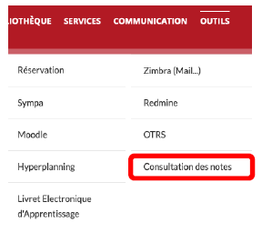
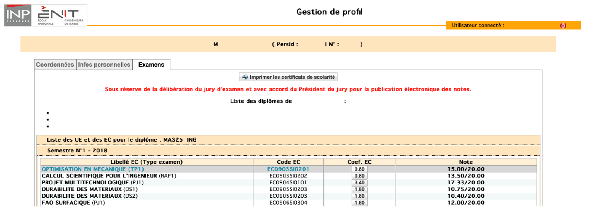

## Consultation de votre dossier personnel
Vous pouvez accéder à une partie de votre dossier personnel, pour consultation. Cet accès comprend vos coordonnées, des données personnelles et vos résultats pour l’année en cours.  
L’accès se fait en cliquant sur "Consultation des notes" dans le menu outils.  
  
  
