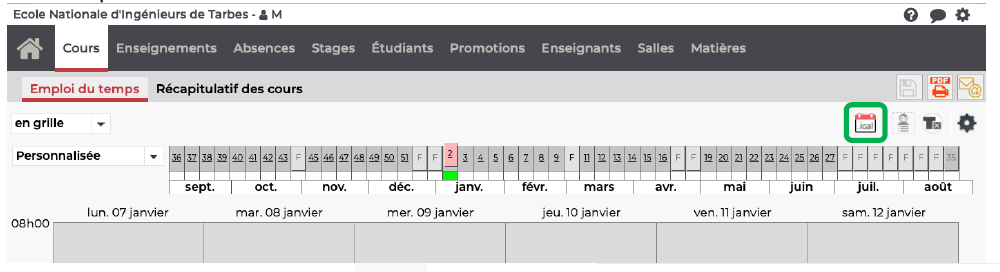
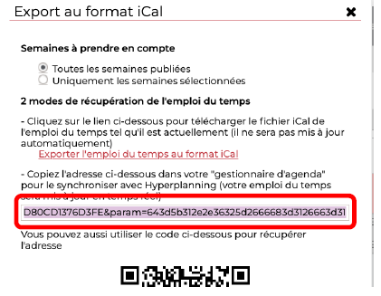
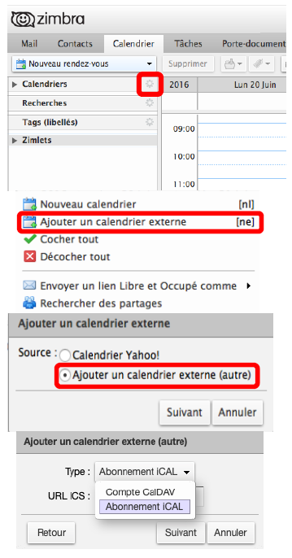
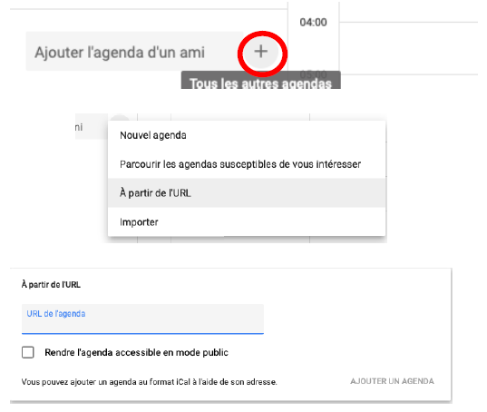
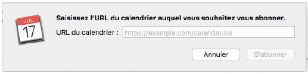
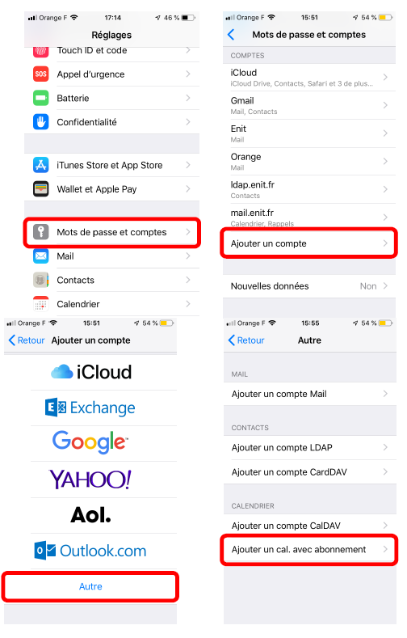

## Emploi du temps : hyperplanning
Hyperplanning est le logiciel d’emploi du temps de l’ENIT. A l’adresse planning.enit.fr, après identification, vous accédez à votre emploi du temps de cours personnel, mais aussi à un bilan de vos absences, à l’emploi du temps des salles de classe, etc. Cet emploi du temps est donné pour l’intégralité du semestre, vous devez vérifier que tous vos enseignements y apparaissent (contactez votre responsable pédagogique si ce n’est pas le cas).  
L'emploi du temps peut évoluer au cours du semestre, fréquemment et sans notification. Il vous faut le vérifier régulièrement. L'utilisation d'un agenda électronique mis à jour automatiquement est donc conseillée.  
Hyperplanning permet d'exporter son emploi du temps vers un agenda électronique où il sera mis à jour automatiquement. La procédure se fait en 2 temps :
  1- Récupération du lien de l'emploi du temps hyperplanning
  2- Création de l'agenda (4 agendas décrits)

### Récupérer le lien dans hyperplanning
- Se connecter sur son espace hyperplanning.net (planning.enit.fr)
- Cliquer sur Cours  
  
- Cliquer sur le bouton calendrier
  - La fenêtre ci-dessous apparaît  
		  
  - Sélectionner l'intégralité du lien (qui est très long)
  - Le copier (Ctrl+C ou Cmd+C)

### Créer l'agenda

#### Zimbra
- Se connecter à son espace Zimbra (votre compte mail sur mailetu.enit.fr)
- Cliquer sur l’engrenage
- Sélectionner « Ajouter un calendrier externe »
- Choisir « Ajouter un calendrier externe (autre) »
- Dans la liste déroulante, choisir « abonnement iCAL »
- Coller l’adresse copiée depuis votre espace hyperplanning dans la seule ligne disponible
- Choisir le nom et la couleur de votre calendrier
- Valider  
  

#### Google Agenda (pour téléphone Android)
Dans un explorateur internet, aller à l'adresse [https://calendar.google.com/calendar/r](https://calendar.google.com/calendar/r) et se connecter avec son compte google (Gmail).
- Cliquer sur le + dans la partie gauche de la fenêtre, juste sous le calendrier.
- Choisir "A partir de l'URL"
- Dans la fenêtre apparue, coller l'adresse copiée depuis hyperplanning.net
- Cliquer sur "Ajouter un agenda"  
  

#### Calendrier (MacOS)
- Ouvrir calendrier
- Aller sur Fichier/abonnement à un calendrier  
  
  - Coller l'adresse copiée depuis votre espace hyperplanning dans la seule ligne disponible
  - Cliquer sur "S'abonner"

#### Calendrier (pour IOS)
- Ouvrir les réglages du téléphone
- Choisir "Mots de passe et comptes"
- Choisir "Ajouter un compte
- Choisir "Autre"
- Choisir "Ajouter un cal. avec abonnement
- Coller l'adresse copiée depuis votre espace hyperplanning (paragraphe 5.2.1.) dans la seule ligne disponible
- Terminer  
  
