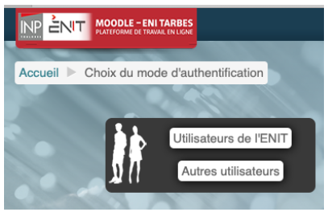

## Plateforme d'enseignement à distance : Moodle
L’ENIT dispose d’une plateforme d’enseignement à distance sur moodle : moodle.enit.fr Vous devez vous connecter avec vos identifiants LDAP en choisissant « Utilisateurs de l’ENIT ». Vous avez ensuite accès à tous les enseignements de l’école. La plupart des enseignements sont soumis à une inscription par mot de passe. Ce mot de passe vous est fourni par l’enseignant par mail ou de vive voix.  
  
Adoptez un comportement responsable dans moodle :
- Téléchargez les documents du cours dans votre espace pour travailler hors ligne,
- Inscrivez-vous au cours rapidement après avoir eu le mot de passe,
- Ne jetez pas le mail vous indiquant le fonctionnement du cours dans moodle.
