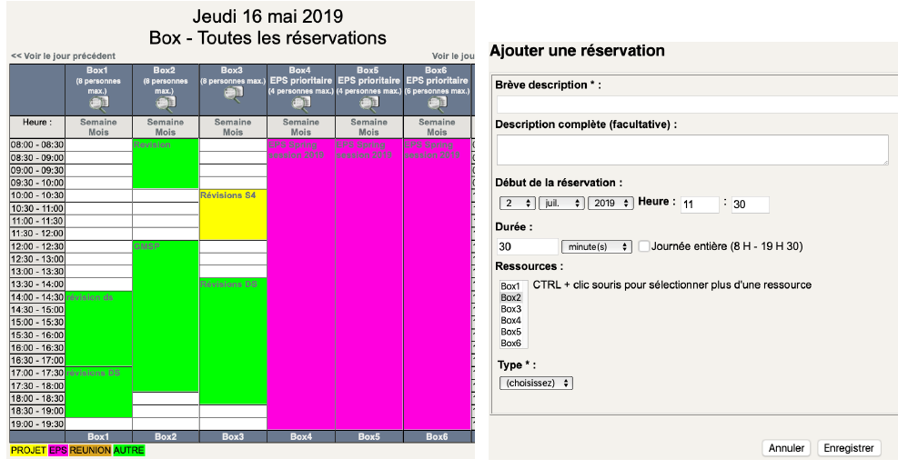

## Réservation de salles de projet
Six salles de travail sont à votre disposition du lundi au vendredi de 8h à 19h pour travailler en groupe. Elles sont réservables sur [https://portail.enit.fr/grrbox](https://portail.enit.fr/grrbox/) pour 30 minutes à 3 heures.
- La loupe vous donne accès à la description de la salle.
- Cliquez sur le plus vert pour créer votre réservation dans la colonne de la salle souhaitée, à l’heure du début de la réservation.
  - Remplissez les informations demandées et enregistrez.
  - Venez travailler !  
  
