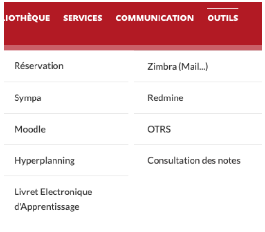

---

# Services numériques
L’ENIT propose divers services numériques, accessibles depuis le menu outils dans l’extranet (après vous être authentifié). L’authentification se fait par votre identifiant LDAP bâti de la manière suivante : initiale du prénom suivi du nom sur 8 caractères maximum. Cet identifiant est appelé pnom dans la suite du document. Cet identifiant et le mot de passe associé sont indiqués sur le certificat de scolarité remis lors de votre inscription.  

