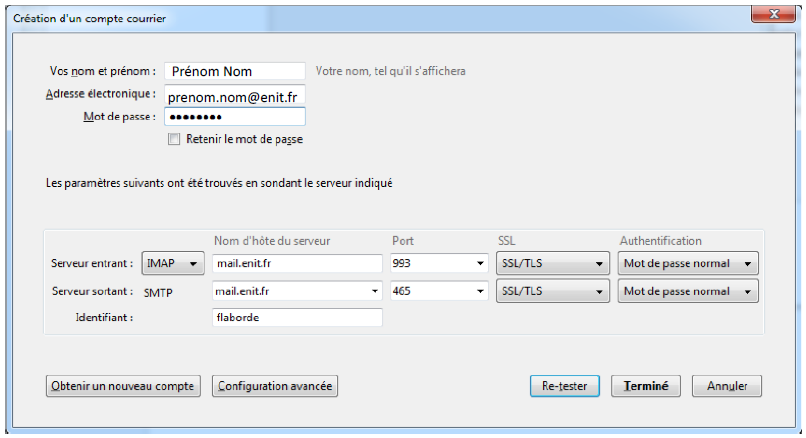

## Messagerie : Zimbra
Chaque membre de la communauté de l'ENIT (personnel ou étudiant) possède une boîte à lettres (adresse e-mail). Cette boîte à lettres est accessible à l'adresse mail.enit.fr, après identification (LDAP).  
L'ENIT communiquera avec vous uniquement sur cette adresse, il est donc primordial de consulter votre boîte à lettres régulièrement. Pour faciliter cette consultation, vous trouverez dans les paragraphes suivants des aides pour utiliser cette boîte à lettres dans vos appareils (téléphones et ordinateurs).

### Configurer Zimbra
Le compte mail principal associé à la boîte est de la forme : pnom@enit.fr, toutefois, afin de faciliter la communication, l'ENIT retient, pour chaque individu, une adresse au format : prenom.nom@enit.fr (sur le compte mail pnom). L'ENIT recommande l'utilisation de l'adresse prenom.nom@enit.fr dans les communications et les échanges.  
Pour que cette adresse soit votre adresse par défaut, merci de configurer votre boîte :
		- Dans l'interface web de votre compte mail (mailetu.enit.fr), aller dans Préférences  
		  
		- Dans Comptes, configurer les paramètres du compte principal de manière à ce que l'adresse prenom.nom@enit.fr soit utilisée par défaut.  
		  

### Configurer un logiciel de messagerie
#### Thunderbird
- Lancer le client de messagerie
- Menu Outils / Paramètres de comptes
- Cliquer sur "Gestion des comptes" / "ajouter un compte de messagerie"
- Compléter les informations :
  - Votre nom et prénom : Prénom Nom
  - Adresse électronique : prenom.nom@enit.fr
  - Mot de passe : le mot de passe du compte LDAP  
  
Cliquer sur continuer, le système recherche les informations vous concernant. Cela peut durer quelques secondes. Il vous propose des informations qui ressemblent à celles-ci.  
  
- Choisir IMAP
- Cliquer sur le bouton Configuration Manuelle et changer les informations :
  - Serveur entrant : mailetu.enit.fr, port 993
  - Serveur sortant : mail.enit.fr, port 465
  - Identifiant : pnom  

#### Mail dans IOS
- Ouvrir les réglages du téléphone
- Aller dans Mot de passe et comptes
- Choisir "Ajouter un compte"  
  
- Choisir "Ajouter un compte Mail"
- Remplir les informations demandées :
  - Nom : Prénom Nom
  - Adresse : prenom.nom@enit.fr
  - Mot de passe : le mot de passe du compte LDAP
  - Description : ENIT
- Compléter les informations du compte (réception et envoi) : 
  - Serveur : mailetu.enit.fr
  - Nom d'utilisateur : pnom
  - Mot de passe : mot de passe LDAP  
  

#### Mail dans MacOS
- Ouvrir préférences système
- Aller dans Comptes internet
- Choisir "Ajouter un compte  
  
- Choisir compte Mail  
  
- Remplir les informations demandées :
  - Nom : Prénom Nom
  - Adresse : prenom.nom@enit.fr
  - Mot de passe : le mot de passe du compte LDAP
- Cliquer sur "Se connecter"  
  
- Compléter avec les informations suivantes :
  - Nom d'utilisateur : pnom
  - Mot de passe : le mot de passe du compte LDAP
  - Type de Compte IMAP
  - Réception : mailetu.enit.fr
  - Envoi : mail.enit.fr
- Cliquer sur "Suivant"
- Terminer  
  
